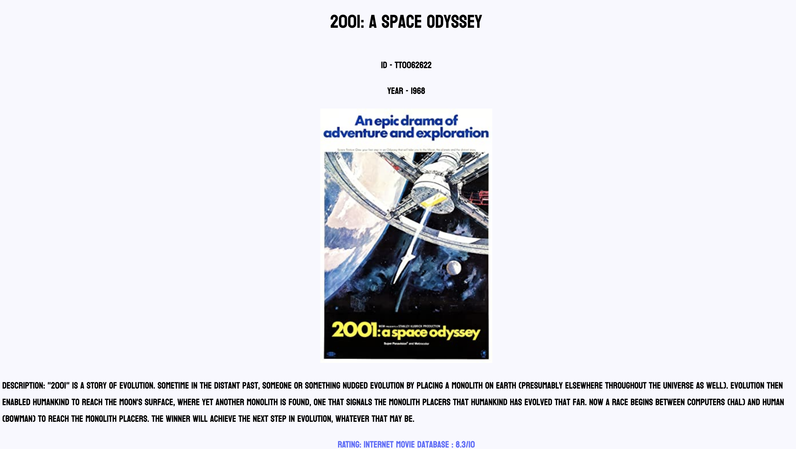

# :mag_right: OMDB API MOVIE LOOK UP :movie_camera:

## Task To Complete:

 Using knowledge of forms and APIs, build a website that will look up information about movies and display the information for users.
  !!!!!!!!!!!!!!!!!!!!!!!!!!DO NOT STEAL MY CODE OR FORK MY PROJECT!!!!!!!!!!!!!!
   !!!!!!!!!!!!!!!!!!!!!!!!!!DO NOT STEAL MY CODE OR FORK MY PROJECT!!!!!!!!!!!!!!
    !!!!!!!!!!!!!!!!!!!!!!!!!!DO NOT STEAL MY CODE OR FORK MY PROJECT!!!!!!!!!!!!!!
     !!!!!!!!!!!!!!!!!!!!!!!!!!DO NOT STEAL MY CODE OR FORK MY PROJECT!!!!!!!!!!!!!!

### What Was Done To Complete The Task: 

- Created local project that uses Vite, Prettier, and ESLint 
- .env file to hide API KEY (imported the key using Vite)
- Used form functionality to take user input for title and lenght of plot 
- When results display it shows Title, Year, Rating, Release Date and Poster
- Installed vite plugin to turn the api calls to HTTPS 

### Preview Of Page: 

